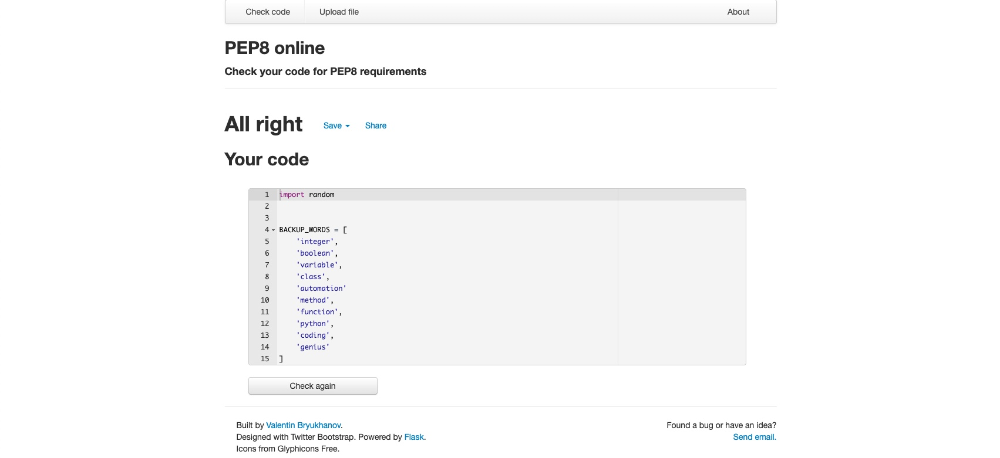

# Terminal Hangman Game

This is my take on the classic game Hangman.
Users can try to guess the correct word before the 10 lives is up.

## How to play

At the start of the game the computer will generate a random word and have them hidden by -.
The aim of the game is to guess the correct word before all the users lives run out.
The user has 10 lives.

## UX - User Expierence

I want the user to:

 - Understand what input is required to proceed and that any exception is returned with a message to the user without  causing the game to crash.
 - Clearly see the number of incorrect guesses before the game ends.
 - Clearly see what the hidden word was if the user fails to guess it before the game ends.
 - Continue playing the game once the game has finished without having to reenter the initial inputs from when the game started by giving the user the option of y/n if they want to keep playing
 - Have a fun time playing the game and that it functions as expected.

## Features

 - The words are ramdomly choosen and hidden behind -
 - The users number of lives are also visible.
 - The user is being prompted for an input of a letter

 

 - If a key is pressed that is not a single letter in the alphabet you will recieve an error without the game crashing.

 

  - If the user guesses the correct word, they then are told the correct word and asks the user if they would like to play again y/n.

  

## Technologies used

 - Python.
 - Am I Responsive: Checking the responsive.
 - PEP8: Check your code for PEP8 requirements.
 - Git Git was used for version control by utilizing the Gitpod terminal to commit to Git and Push to GitHub.
 - GitHub: GitHub is used to store the projects code after being pushed from Git.
 - Heroku: for deployment of the application.

 ## Testing 

### Validator testing 

 PEP8 Online linter (Python validator) The code passed without any errors.

 

 ## Deployment 

 The site was deployed to Heroku. The steps to deploy are as follows:

  - Log in to Heroku.
  - Click "Create new app".
  - Choose app name and choose a region.
  - Click "Create app".
  - Navigate to the "settings" tab.
  - "Click "Reveal Config Vars".
  - Add Config Var in Heroku's Settings. The key is PORT and the value is 8000
  - Scroll down to "Buildpacks".
  - Click "Add Buildpack".
  - First add "python", click save.
  - Second add "nodejs", click save.

## Credits

  - Am I Responsive: Checking the responsive.
  - https://7esl.com/6-letter-words/ for the list or words
  - Stack overflow 
  - My mentor Brian Macharia